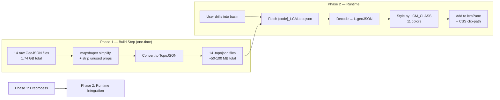

# LCM Display — Implementation Plan

## Strategy

Display LCM as a **per-basin overlay** (like slope), loaded on-demand when the user drills into a watershed. Two phases:



---

## Why This Approach

| Consideration | Decision | Rationale |
|---|---|---|
| **Rendering engine** | `L.geoJSON` on custom pane | Same proven pattern as slope overlay; sub-watersheds also reverted from VectorTileLayer to plain L.geoJSON due to z-order issues |
| **File format** | TopoJSON | Project convention; `window.decodeGeo` already handles decoding |
| **Loading strategy** | Per-basin on-demand | Only 1 basin active at a time; even the largest (ABR: 20K features) is manageable after simplification |
| **Clipping** | CSS `clip-path` on custom pane | Same as slope; tracks map pan/zoom via `slope-manager.js` pattern |
| **Not PMTiles** | Skip for now | Feature counts are low (784–20K polygons, not millions); the bottleneck is vertex density, not feature count — simplification solves this |

---

## Phase 1: Preprocessing Script

### What it does
1. **Simplify geometry** — Sentinel-2 rasterized polygons have excessive vertices. Visvalingam simplification at ~15% keeps shape fidelity while cutting size 80-90%
2. **Strip unused properties** — Keep only `LCM_CLASS`, `ENR_CLCODE`, `AREA_HA`; drop `OBJECTID`, `PSGC_C`, `REGION`, `PROVINCE`, `SERIES`, `SOURCE`, `REMARKS`, `AGG`, `Shape_Length`, `Shape_Area`
3. **Convert to TopoJSON** — Further ~40-60% compression via shared topology

### Size estimates

| File | Raw GeoJSON | Features | Est. TopoJSON |
|------|-------------|----------|---------------|
| CAB | 16 MB | 784 | ~1-2 MB |
| SMR | 20 MB | ~1,000 | ~1-3 MB |
| ZUM | 27 MB | ~1,300 | ~2-3 MB |
| BUD | 42 MB | 2,277 | ~3-5 MB |
| ARI | 56 MB | ~3,000 | ~4-6 MB |
| NAG | 69 MB | ~3,500 | ~5-7 MB |
| MLG | 73 MB | ~3,800 | ~5-8 MB |
| SIF | 81 MB | ~4,200 | ~6-9 MB |
| ABU | 103 MB | ~5,500 | ~7-11 MB |
| AMB | 116 MB | ~6,200 | ~8-12 MB |
| UMT | 145 MB | ~7,700 | ~10-15 MB |
| AGN | 224 MB | ~10,000 | ~15-20 MB |
| ACH | 345 MB | ~17,000 | ~20-30 MB |
| ABR | 422 MB | 20,364 | ~25-35 MB |
| **Total** | **1.74 GB** | | **~60-100 MB** |

---

## Phase 2: Runtime Integration

### 11-Class Color Palette

Official DENR Land Cover Map classification colors:

| LCM_CLASS | ENR_CLCODE | Color | Hex |
|-----------|------------|-------|-----|
| Closed Forest | 01001 | Dark green | `#1a7a2e` |
| Open Forest | 01004 | Medium green | `#4caf50` |
| Mangrove Forest | 01007 | Teal green | `#00897b` |
| Brush/Shrubs | 01010 | Olive | `#8bc34a` |
| Open/Barren | 01013 | Tan/sand | `#d4a76a` |
| Grassland | 01014 | Light green | `#c6e567` |
| Annual Crop | 01016 | Yellow | `#fdd835` |
| Perennial Crop | 01017 | Orange | `#ff9800` |
| Fishpond | 01019 | Light blue | `#4fc3f7` |
| Built-up | 01020 | Red/pink | `#e53935` |
| Inland Water | 01021 | Blue | `#1565c0` |

### Files to Create/Modify

| File | Action | What |
|------|--------|------|
| `preprocess-lcm.mjs` (project root) | **Create** | Node.js script using mapshaper to simplify + convert all 14 files |
| `public/geoJSON/LCM/` | **Create dir** | Output directory for preprocessed `.topojson` files |
| `src/lib/lcm-manager.js` | **Create** | New module following `slope-manager.js` pattern |
| `src/lib/index.js` | **Modify** | Add `import './lcm-manager.js'` |
| `src/lib/config.js` | **Modify** | Add `lcmColors` map and `lcmClasses` array |
| `src/lib/app.js` | **Modify** | Add `showLcm` state, LCM toggle in overlays panel, update legend |
| `src/lib/hydro-mode.js` | **Modify** | Wire `_lcmCode` to actually trigger LCM fetch on basin drill |
| `src/assets/css/map.css` | **Modify** | Add `.lcm-legend` styles |

### `lcm-manager.js` — Key Architecture

```js
APP.lcm = {
  _layer: null,          // L.geoJSON layer
  _clipFeature: null,    // Current clip boundary
  _currentCode: null,    // Currently loaded basin code (e.g. 'ABR')

  async toggle() { ... },        // Toggle on/off (like slope.toggle)
  async _loadBasin(code) { ... },// Fetch + decode TopoJSON for basin
  updateClip(feature) { ... },   // CSS clip-path on lcmPane
  removeClip() { ... },
  reapplyClip() { ... },         // RAF-batched clip updates
  hide() { ... },                // Drill transition
  show() { ... },                // Drill transition restore
  destroy() { ... },             // Full teardown
};
```

### UI Integration

The overlay toggle appears in the existing "Map Overlays" panel section (only at `hydroDrillLevel === 1`):

```
┌─────────────────────────┐
│ Map Overlays            │
│ ○ Sub-watersheds    [⬜] │
│ ○ Stream Order      [⬜] │
│ ○ Slope             [⬜] │
│ ○ Land Cover (LCM)  [⬜] │  ← New toggle
└─────────────────────────┘
```

### Legend (bottom-right, alongside slope)

When LCM is toggled on, the legend shows all active classes with colored swatches. If both slope and LCM are active, both legends appear stacked.

---

## Execution Order

1. ✅ Approve this plan
2. Run preprocessing script (`node preprocess-lcm.mjs`) — one-time, outputs to `public/geoJSON/LCM/`
3. Add LCM color config to `config.js`
4. Create `lcm-manager.js` (fetch, render, clip, toggle, legend)
5. Wire into `index.js`, `app.js` (state + panel toggle), `hydro-mode.js` (drill trigger)
6. Test with dev server

> [!IMPORTANT]
> The preprocessing step (Phase 1) must run first — the raw files are too large to serve directly. The script will take a few minutes to process all 14 basins.
